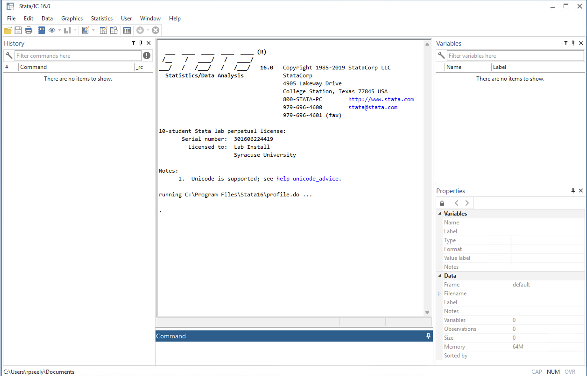

# Stata {#stata-section}

There are many different coding languages used to handle and analyze data. You have probably heard of some, like Python, R, SQL, Java, and more. In ECN 310, we use a coding language and platform called Stata. We choose to use Stata because it is a preference among many economists and will prepare you for further economic research opportunities.

Stata is the name for both the commands used to tell the computer what to do (the coding language, like LaTeX), and it is the name for the system used to understand the commands and perform actions (like Overleaf). Many actions can be performed in Stata either by typing out commands or by using a point-and-click interface, meaning that you can also click buttons to perform analyses and make data visualizations.

If you want to get a feel for how Stata works, you can access it through Syracuse University’s Remote Desktop Service (RDS). Stata is a proprietary language, meaning that it must be paid for to use it. The university pays for access to Stata, but you must access it through a university computer, which can either be through the RDS on your own computer, or on a desktop computer in a university building (Bird Library, for example). 

To access the RDS through your browser, go to http://rds.syr.edu. Then, sign in using your university email and password like you would to access MySlice. Detailed instructions from the university can be found [here](https://answers.atlassian.syr.edu/wiki/spaces/ITHELP/pages/159941285/Remote+Desktop+Services+via+Browser). Once you are on the RDS, you can search for the Stata app.

## Stata Basics

When opening the Stata app, you will see five panels (and a bar at the bottom). These carry information on the data you work with in Stata and how you interact with it.

1. The Command panel at the bottom is where you type out commands to the computer. Remember: you communicate to the computer by writing in the Stata programming language, and the computer receives commands and reports back to you in the Stata app. In the command window, you type out commands and send them by pressing the “Enter” or “Return” button on your keyboard. 
2. The "Results" window in the center displays the results of your commands. 
3. The “History” window on the left shows you a history of previously sent commands. 
4. The “Variables” window lists the variables in your current dataset. Right now it's empty since no dataset is loaded. 
5. The “Properties” window shows detailed information about the dataset and selected variables. 
6. The file path bar at the bottom shows the location on your computer where you are reading files from.

## Stata Exercise

If you want to test out how Stata works, follow along for this brief exercise.

1. In the Command window, type out `sysuse census`. You can also copy and paste the words between the apostrophes (excluding the apostrophes) into the command window. Then press Enter on your keyboard.

As you can see, this loads in a dataset called “census”. This dataset contains 1980 U.S. Census data aggregated to the state level. In the Variables window, you can see the names and labels of the variables. A variable called “state” is the first one, followed by “state2”, “region”, “pop”, and more. You can also see in the History window that the command you just typed is stored there.

2. Next, type `browse` into your command window and hit enter.

This will open up another window where you can view all of the data currently loaded into Stata. You can look around to see what’s interesting and exit the window when you are done.

3. Type in `list in 1/3` into the Command window and hit enter.

This shows the first three state’s values for each of the variables. You can see that the command tells Stata to make a list of the first three observations. The language of many commands is similar to this, where you type in abbreviated or short-hand English.

4. Type `summarize pop` into the Command window and hit enter.

In the Results window, you will see that you get information on the `pop` variable, like how many observations there are, the average (or mean), the standard deviation, and minimum and maximum values.

5. Type `scatter death marriage` into the Command window and hit enter.

This should display a scatterplot of each state’s number of deaths and number of marriages values. Each dot represents one state. You can exit this window when you are done viewing it. Note that it will not save anywhere (but you can re-create it with the same command later).

So far, we have just viewed the data. We can also edit it. Let’s create a new variable. Right now, the `pop` variable shows the number of people in each state. We can create a variable that will show how many million people live in each state.

6. Type `generate pop_millions = pop / 1000000` and hit enter.
7. Then type `label variable pop_millions "Population in millions"` and hit enter. 

You can now see in the Variables window that you have a new variable called “pop_millions” that is labeled with “Population in millions”. You can type “summarize pop_millions” to confirm that you have made this new variable and see that the average population of each state in 1980, in millions, is about 4.5.

8. When you are done experimenting in Stata, you can simply close out of the Stata window.

Note that when you close out of the Stata window, none of the data or work you did will be saved. For now, that is okay. Saving your work can become tricky when working with Stata, GitHub, and multiple different files of data and code. We will practice this together in class.

## Learning More on Stata

For now, we recommend that you pause here in learning Stata. More instruction will be coming soon on how you can use one of the course textbooks, _An Introduction to Statistics and Data Analysis Using Stata® : From Research Design to Final Report_, authored by Lisa Daniels and Nicholas Minot. The textbook can be viewed online through Syracuse University's online library [here](https://research-ebsco-com.libezproxy2.syr.edu/c/gvriom/search/details/qcsbnwmqtn?db=nlebk). 

In ECN 310, you will do a short reading before each class (like from the Daniels & Minot textbook), and you will be asked to complete a reading quiz on Blackboard. But, you get to know the exact questions that will be on the quiz! This is because Professor Buzard gives you a "quiz prep" document on Blackboard that contains each of the questions, so you can mark down the answers as you read. Here are two example quiz prep documents that ask you to read a portion of the Daniels & Minot textbook and interact with the reading. You can view the quiz prep documents for the [Introduction to Stata](/Users/ryanseely/Documents/GitHub/SummerResource/d&m_intro_stata_quizprep.pdf) and [Data Cleaning & Checking for Outliers](/Users/ryanseely/Documents/GitHub/SummerResource/d&m_cleaningdata_outliers_quizprep.pdf) sections of Daniels & Minot. 

If you want to mimic what you would do in class, you can...

1. Read the textbook section
2. Answer the questions on the quiz prep as you read

The final step would be to take the quiz based on how you answered the quiz prep questions.